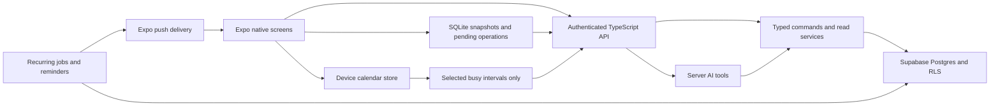

# Architecture audit and recommendation

Audited 19 September 2026 at `4a528c96caf41515a70291ccecbba9d7b35e3349`. This is source/design analysis, not a production security certification or device test. The [confirmed product brief](product-and-design.md) is the target; legacy feature parity is not.

## Findings

| Priority         | Evidence in the current repository                                                                                                                                                                                                                                 | Consequence for the rewrite                                                                                                                                                                                              |
| ---------------- | ------------------------------------------------------------------------------------------------------------------------------------------------------------------------------------------------------------------------------------------------------------------ | ------------------------------------------------------------------------------------------------------------------------------------------------------------------------------------------------------------------------ |
| Release blocker  | `apps/mobile/app/(tabs)` has five product screens. Their loaders and mutation wrappers expose only subsets of the old application.                                                                                                                                 | Replace the interface and workflows; adding more buttons to these screens will not deliver the agreed design.                                                                                                            |
| Release blocker  | No mobile assistant transport/UI. `src/app/api/assistant/chat/route.ts`, `src/lib/ai/toolkit.ts` and executors live in the web runtime. `src/lib/supabase/server.ts` obtains identity through Next cookies; `src/proxy.ts` redirects unauthenticated member paths. | Native bearer authentication must reach all command/read dependencies. Adding an Authorization header to the existing chat endpoint alone will not fix cookie-bound executors or proxy redirects.                        |
| Release blocker  | Mobile has no SQLite dependency, durable outbox or reconciliation protocol. `useSessionBoundLoad.ts` provides in-memory query state; realtime signals trigger refetches.                                                                                           | Offline operation is new engineering, not a switch on Supabase Realtime.                                                                                                                                                 |
| Release blocker  | Grocery mutations call start/claim/finish-session RPCs. `finishShoppingSession` explicitly declines expense-draft creation.                                                                                                                                        | The new checklist needs new server semantics and a separate expense handoff. Hiding session buttons would leave the old state machine underneath.                                                                        |
| Release blocker  | `private.generate_due_recurring_drafts_for_household` and existing recurring-expense rules generate drafts.                                                                                                                                                        | Automatic fixed expenses require a new approved rule mode, versioned authorization, durable scheduling and duplicate-proof posting. Never reinterpret all historical rules as automatic.                                 |
| Release blocker  | No calendar module in the mobile package. Existing `src/lib/calendar` handles server-side CalDAV, credentials and editable events.                                                                                                                                 | Implement native device reads and privacy-preserving availability sharing. The old server calendar integration does not provide personal iPhone overlays.                                                                |
| Release blocker  | `expo-notifications` is installed, but mobile has no enrollment/delivery-handling implementation. Existing push delivery uses Web Push endpoints, `p256dh` and VAPID.                                                                                              | Native device registration, Expo/APNs delivery, token lifecycle and deep links are required. Existing web push is not APNs delivery.                                                                                     |
| High             | `apps/mobile/src/lib/supabase.ts` persists sessions in AsyncStorage; its README calls the token “not a secret.”                                                                                                                                                    | Correct that assumption: access/refresh tokens are credentials. Implement and test protected credential storage, migration, logout, and account-scoped local data cleanup. The publishable API key is a different thing. |
| High             | `src/domain/money` has pure allocation, balance, correction and recurrence rules plus focused/property tests. Database migrations implement transactional ledger commands and RLS.                                                                                 | Preserve and revalidate these assets. Replacing them has a material migration cost without an identified native-UX benefit. Tests being present is not proof they passed during this audit.                              |
| High             | Mobile data access uses generic `rpc(name: string, args: Record<string, unknown>)` and handwritten result casts.                                                                                                                                                   | Share typed, runtime-validated command contracts; use generated database types at storage boundaries. Compile success currently cannot detect every query/schema mismatch.                                               |
| High             | `src/lib/ai/definitions` is a shared tool registry, but it advertises legacy modules now excluded from scope. Existing approval classification focuses on financial history.                                                                                       | Keep the registry pattern, narrow exposed capabilities, and extend approval policies for recurring mandates, meal proposals and memory. Do not blindly expose every legacy tool.                                         |
| High             | Most mobile screens map data into ordinary ScrollViews with inline forms and a small static token palette.                                                                                                                                                         | New design system, navigation, virtualized long lists, accessible text and consistent keyboard/error behavior are needed. “Clunky” is the owner's experience; this audit did not reproduce visual behavior on-device.    |
| Verification gap | Seven mobile `.test.ts` files cover selected helpers/session/loading. CI's `mobile:check` is lint and typecheck; root Vitest includes mobile tests. No native E2E flows were found.                                                                                | Preserve useful tests and add observable device journeys. Browser Playwright and build success do not establish native readiness.                                                                                        |

The earlier successful simulator build predates later changes and was not a simulator execution. The previously observed Linux/EAS simulator limitation is a historical blocker to recheck before implementation, not a claim about present account entitlement.

## Keep, change, retire

| Asset                                                                             | Recommendation                                                                                                                                          |
| --------------------------------------------------------------------------------- | ------------------------------------------------------------------------------------------------------------------------------------------------------- |
| Existing household IDs, auth identities, ledger/events/allocations, receipt links | Preserve, with explicit migration reconciliation.                                                                                                       |
| Postgres transactional rules, tenant policies and domain tests                    | Reuse where behavior is unchanged; add append-only migrations and focused tests for changes.                                                            |
| Pure CHF/date/recurrence helpers                                                  | Reuse. Move into `packages/domain` when needed with one canonical implementation; the package is currently a placeholder.                               |
| Existing Apple sign-in and startup fixes                                          | Retain proven fixes while testing real device auth, refresh and logout.                                                                                 |
| Web-coupled commands/read models                                                  | Refactor into explicit authenticated services. Preserve validation, retry and concurrency behavior, not cookie or redirect dependencies.                |
| Mobile screens, query orchestration and navigation                                | Rebuild for the agreed four-tab product.                                                                                                                |
| Shopping-session model                                                            | Retain legacy history, replace the live checklist command model.                                                                                        |
| Web push transport                                                                | Replace for native delivery; retain useful scheduling/outbox rules after review.                                                                        |
| CalDAV sync and credentials                                                       | Not needed for the proposed read-only EventKit design. Preserve existing data and disconnect/retire the old integration only at an approved cutover.    |
| Old web UI and excluded feature modules                                           | Keep available in source/history during migration; retire from the deployed product after data reconciliation and explicit cutover. No new web screens. |

## Infrastructure options

Prices checked against official pages on 19 September 2026. Amounts below are published USD, not converted CHF estimates. Any paid option must fit the aggregate CHF ceiling including applicable exchange rate, tax and other subscriptions at purchase time.

| Option                                               | Benefit                                                                               | Cost and maintenance tradeoff                                                                                                                                                        | Assessment                                                                                                        |
| ---------------------------------------------------- | ------------------------------------------------------------------------------------- | ------------------------------------------------------------------------------------------------------------------------------------------------------------------------------------ | ----------------------------------------------------------------------------------------------------------------- |
| Supabase + Expo SQLite with a narrow operation queue | Keeps ledger, identities and RLS; no additional sync vendor.                          | We own a small but real synchronization protocol and its tests. Supabase Free is $0, has quotas, and can pause after one inactive week.                                              | **Recommended baseline**, provided the two-action offline spike passes.                                           |
| Supabase + PowerSync                                 | Managed replication into local storage can remove plumbing if offline scope grows.    | Free plan exists, with inactivity deactivation; Pro starts at $49/month. Another authorization/replication boundary; command conflict rules still require design.                    | Evaluate only if the narrow queue becomes significantly more complex. Do not adopt a paid plan under this budget. |
| Replace Postgres with Convex                         | TypeScript-oriented backend and reactive client model may simplify a new application. | Free entry plan exists, but rewriting authorization, financial transactions, migrations and operations is substantial. Do not assume reactive queries prove durable offline support. | No current evidence that a full migration makes this two-person product simpler overall.                          |
| Self-host database/backend                           | More control over deployment.                                                         | Requires patching, availability management, recovery and operations even if the server is cheap.                                                                                     | Not recommended for the goal of reducing household effort.                                                        |

Sources: [Supabase pricing](https://supabase.com/pricing), [PowerSync pricing](https://powersync.com/pricing), [Convex pricing](https://www.convex.dev/pricing), [Convex client overview](https://docs.convex.dev/client/javascript/overview).

Recommended initial recurring infrastructure spend: **CHF 0 within free-tier quotas**, not a guarantee of unlimited capacity or uptime. Existing personal/non-commercial Vercel Hobby can host the thin API; validate actual function/runtime limits during the API spike. No website is required to host an API. Native push can use Expo's service. Build/test services count against the infrastructure budget unless separately approved; Apple membership and model usage are the agreed exclusions. Do not upgrade subscriptions or silently enable overages. See [Vercel Hobby](https://vercel.com/docs/plans/hobby) and [Expo push FAQ](https://docs.expo.dev/push-notifications/faq/).

## Proposed runtime boundaries

Use `apps/mobile` for presentation and local device adapters, a thin `apps/api` runtime for authenticated requests/streaming, `packages/domain` for pure rules, and a small shared contract package for request/response validation. Server services stay server-only. These are proposed boundaries, not instructions to create many packages before delivering a feature.

Extract a single representative service from Next before moving everything. Each service receives a request-scoped verified member and user-scoped database client. Verify Supabase bearer identity and current household membership; never accept actor identity from request/model fields. Remove implicit `cookies()`, React request caches, redirects and `revalidatePath` from shared business services. Preserve equivalent authorization for browser calls during transition. Never store a current user in a module global.

Use a finite typed command registry, not arbitrary table/RPC names from clients or the model. UI and AI call the same commands. Side-effect policies, version checks, idempotency keys, approval references and machine-readable errors belong at this boundary. Secrets and model credentials remain on the server. The native bundle contains only public configuration.

Effect v4 is an explicit owner requirement for the rewrite, including the client application layer and server services, extending ADR 0031 beyond mobile mutations. Use Effect Schema for new contracts, Context/Layer for dependency injection, typed errors, scoped resources, cancellation and controlled retries. Keep React components declarative, with a small runtime/hook adapter at their boundary rather than running a separate unmanaged Effect runtime per component. Pure domain calculations do not need artificial effects. Use SQLite-backed repositories for offline views, local React state for transient form state, and one deliberate query/invalidation layer. Avoid stacking multiple competing caches or introducing a new state framework without a demonstrated need.

## Offline protocol: deliberately limited

Release-one offline writes are **set grocery checked state** and **complete an existing chore occurrence**. Creating/editing definitions, editing schedules, meals, money, reminders and settings remain online unless separately expanded. Conflict protection still applies to online edits made from stale forms; it does not imply offline schedule editing.

1. Persist the local projection and pending command in one SQLite transaction. Commands carry a stable operation UUID, actor/household, target identity, expected version and payload. Device time is informational, not authoritative ordering.
2. Scope every database/cache/queue to the signed-in member and household. Authentication expiry pauses replay. Never replay a previous user's commands after switching accounts. Warn about pending work before destructive local logout; preserve it safely for the same identity or obtain explicit discard.
3. On foreground/reconnect, send commands in per-record order. The server authorizes, records a unique operation receipt and applies the state transition atomically. A lost response is retried with the same ID.
4. A receipt returns canonical state/version. Mark the operation acknowledged and update the local projection atomically. Realtime only prompts refresh; it is not a durable change log.
5. Fetch bounded authoritative snapshots for active chores/groceries after replay; reconcile removals and archives without erasing pending overlays. Page historical money separately. Do not add an unproven timestamp cursor that can skip committed rows.

| Situation                                            | Required resolution                                                                                |
| ---------------------------------------------------- | -------------------------------------------------------------------------------------------------- |
| Both check the same grocery                          | Converge on checked; no duplicated purchase or money event.                                        |
| Both complete the same occurrence                    | One canonical completion and one next occurrence; second operation reports already completed.      |
| Check and uncheck from conflicting versions          | Preserve both intents and surface a small conflict choice; no silent device-clock last-write-wins. |
| Completion races with reschedule/skip/archive        | Re-evaluate the original occurrence/version; never complete the replacement silently.              |
| Record deleted or access revoked                     | Do not resurrect/recreate it. Explain why the queued action could not apply.                       |
| App killed after server commit before acknowledgment | Retry returns the existing receipt; no second side effect.                                         |

Store credentials through a tested Keychain/SecureStore adapter; account for size/error handling and migration from AsyncStorage. SQLite is not automatically encrypted: keep secrets out, use iOS file protection, and assess SQLCipher if persistence includes private chat/profile content. Initial local retention should cover only what the offline feature needs. [Expo SQLite](https://docs.expo.dev/versions/latest/sdk/sqlite/) documents persistence and encryption configuration.

## Financial scheduling

Retain CHF integer arithmetic, deterministic percentage-to-centime allocation and append-only corrections. Add an explicit recurring mode: fixed automatic versus variable confirmation. An approved automatic mandate binds rule version, amount, payer, split, cadence and start date. AI setup/edits require approval; the user's UI Save can grant the mandate when automatic posting is clearly explained.

Each due cycle gets a stable identity independent of retries or harmless edits. Post the event, ledger entries and cycle receipt in one transaction, with uniqueness on rule + due cycle so editing a rule cannot create a second entry for the same period. Serialize scheduler execution with rule updates/cancellation. Catch-up runs after downtime must deduplicate; activation must not backfill historical periods without explicit approval. Pausing blocks future posting and never deletes past entries.

Existing rules retain draft mode until individually opted in. A manual expense is never auto-matched to a recurring cycle by description alone; provide an explicit cycle link/recorded acknowledgment where necessary to avoid duplicate obligations. Variable drafts and fixed automatic entries must never both post for the same cycle. Preserve who authorized the mandate separately from the system job that executes it.

## Calendar privacy and freshness

Use native EventKit through a compatible Expo calendar adapter. Each member chooses calendars already available on their phone. Shared iCloud events stay in iCloud; personal titles, descriptions, locations, attendees and source IDs stay on-device. No new CalDAV password form or server copy of personal event details is needed.

To share availability, compute merged busy intervals locally for a bounded planning horizon, then upload only owner/household, interval bounds, snapshot generation, covered range, timestamp and consent version. Avoid personal titles, calendar names and stable external event identifiers. Each partner independently opts in. Do not duplicate shared-calendar events as personal busy blocks. Honor free/declined/cancelled availability semantics and timezone/DST boundaries.

Publish snapshots atomically; reject older generations and clear data on consent revocation. Recommended initial horizon: next eight weeks; mark data older than 24 hours stale and treat missing/out-of-range data as **unknown**, never free. Validate these operational defaults in the prototype. Foreground refresh is required; background refresh is best effort. iOS decides background scheduling, so continuous availability cannot be promised. [Expo BackgroundTask](https://docs.expo.dev/versions/latest/sdk/background-task/).

Calendar reads require permission. The current SDK 57 documentation says the calendar module needs a development build and is unsupported in Expo Go. Device testing, including permission denial/revocation and work-calendar availability, is an early gate. [Expo Calendar](https://docs.expo.dev/versions/latest/sdk/calendar/).

## AI and private data

Keep the shared schema/executor pattern and provider abstraction. Filter to the new product's supported tools, and test both tool coverage and policy. Private chats and memory require owner-specific policies within the household, not merely household RLS. Authorize transcript access and bind approval records to the member, invocation, payload/version and expiry. Invalid, edited or replayed approvals cannot authorize a different write.

- Ordinary supported commands execute as requested, subject to existing permission/assignment rules.
- Financial writes and automatic recurring-rule setup/changes require explicit confirmation. A scheduled posting uses its already approved mandate.
- Meal-week generation creates a proposal, never writes the active plan. Approval uses the displayed proposal revision and occupied-slot versions; failed/conflicting approval does not partially overwrite the week.
- Grocery review is separate and idempotent. Editing a generated proposal must preserve member changes and never reintroduce excluded ingredients silently.
- Memory additions require explicit consent and are inspectable/editable/deletable. Do not automatically convert private conversation into household memory.
- Device permissions, native calendar selection and receipt picking use honest handoffs. A tool must never claim those steps completed without device acknowledgment.

Use authorized dietary constraints and busy intervals in meal generation; do not send personal event text. Calorie values are estimates, not measured nutrition or health advice; do not require a nutritional tracking service. Structured meals still need schema validation and constraint checks. Private calorie goals must not appear in partner tool responses or summaries.

### Effect v4 with Vercel AI SDK (confirmed architecture)

Use Effect v4 for the application/service layer and Vercel AI SDK for model calls, chat streaming, tool orchestration and approval interaction. Do not add Effect AI as a second orchestrator. Hosting remains an independent choice.

1. The native chat uses the AI SDK React chat integration and an Expo-compatible streaming transport, validated against the pinned SDK versions. Native components render messages, tool results, meal proposals and approval cards.
2. The API verifies bearer identity and provides request-scoped Effect services for membership, private conversations, approvals and household commands. AI SDK runs model generation and invokes a finite tool registry.
3. Each tool handler is a thin Promise adapter over the same Effect command used by native UI actions. Effect owns authorization, validation, database work, idempotency and typed domain errors. The adapter maps safe errors/results to the SDK without exposing secrets or internal causes.
4. Wire request cancellation into the Effect execution scope; clean up fibers and streams on disconnect. A disconnected response does not imply a committed database transaction was rolled back. Retrying an uncertain write must use its original operation identity. Coordinate SDK and Effect retry policies to avoid multiplying requests or replaying side effects.
5. Persist private conversations and pending actions explicitly. Financial approvals bind member, invocation, exact payload/version and expiry. SDK approval UI/state is not the authorization boundary; the shared command service validates approved server state before executing. Meal proposals and memory consent retain their separate policies.

Use Effect Schema as the canonical contract for new application commands. Adapt those schemas to the AI SDK's supported schema interface, proving conversion and runtime validation for the pinned versions. Do not maintain independently handwritten Effect and Zod schemas for the same new command. Preserve existing Zod contracts behind adapters during migration where useful.

Keep one owner for chat state/transport: the AI SDK integration. Effect manages the surrounding application services and resources; do not implement a competing chat stream state machine simply to wrap every SDK operation. Keep persisted conversation records versioned and test serialization compatibility when upgrading.

M2 must prove authenticated streaming, one shared command invoked through UI and AI, schema conversion, structured meal output, cancellation, bounded model execution, and durable approve/deny/resume after interruption. The official [AI SDK Expo guide](https://ai-sdk.dev/docs/getting-started/expo) is a starting point; verify APIs against the installed major version before implementing.

## Notifications and operations

Extend the existing durable outbox pattern for native device registrations and Expo delivery tickets/receipts. Disable invalid tokens, isolate tokens by member/device, and handle sign-out/reinstallation. Reminder identity includes recipient, item, schedule version and scheduled occurrence to prevent duplicate deliveries. Recipient preferences override sender selections. Rescheduling or completing an item cancels obsolete scheduled reminders.

Daily summaries should be deterministic database reads. Do not call an LLM every day for ordinary notification text. Exact delivery time cannot be guaranteed by APNs, device focus settings or network conditions. Keep content available inside the app even when push is delayed. Calendar reminders use read-only event references and privacy-safe payloads; stale/deleted events and revoked access must invalidate them rather than expose personal text to another member.

Use existing server scheduling capacity after validating execution/quotas. Do not depend on a phone waking up to post recurring expenses. Avoid adding a second scheduling vendor or paid observability subscription by default. Scrub logs of tokens, private chats and personal calendar contents. Capture build identifiers and actionable error categories using existing logs/crash reports.

## Uncertainty and proof still required

- A physical iPhone/development-build testing route and simulator access must be established. No current live device results were produced here.
- Actual table sizes, hosted quotas, remote deployments, APNs credentials and data quality were not inspected. Inspect narrowly during implementation/migration planning without dumping household contents.
- The narrow sync design must survive fault-injection tests before wider feature work. Reconsider managed sync if that proof fails; do not quietly broaden custom synchronization.
- Free-tier pausing and function limits are operational constraints, particularly for scheduled expenses. Test recovery and show delayed scheduling honestly.
- The Supabase changelog Markdown endpoint failed during research; the official [breaking-change index](https://supabase.com/changelog?types=breaking-change) was checked instead. Recheck current runtime/SDK docs before implementation.
