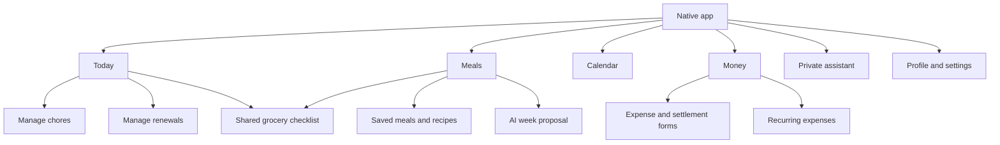

# Product and design brief

Status: product requirements confirmed in conversation on 19 September 2026. Quiet was selected from the interactive HTML prototypes on 19 September 2026. Detailed native layouts remain subject to usability and accessibility verification. See [audit](architecture-audit.md) and [delivery plan](implementation-plan.md).

## Name and artwork

The app is named **Nest**, as confirmed by the owner on 19 September 2026. Use Nest in the native app display name, onboarding, notification branding and other product-facing copy. Existing repository, bundle, EAS and database identifiers need not change for this rename.

Use image generation for any new imagery or artwork needed by the rewrite, including app-icon artwork, illustrations and onboarding images. Keep generated assets consistent with Quiet's restrained olive and warm-neutral palette. Do not add decorative images where they would make household actions harder to scan. Standard functional interface icons remain native symbols or the chosen icon library.

## Approved visual direction: Quiet

The owner selected **Quiet** on 19 September 2026. Use the [interactive prototype](prototypes/index.html) as the visual baseline: warm off-white backgrounds, soft olive accents, dark green text, open spacing, restrained rounded surfaces, clear sans-serif typography and understated line icons. Carry the same semantic hierarchy into dark mode.

Preserve the four-tab structure and the emphasis on quick, obvious household actions. Native implementation should adapt controls to iOS, Dynamic Type, VoiceOver and Reduce Motion, with subtle completion haptics and purposeful motion. The HTML's simulated phone chrome and scripted demo behavior are not production implementation requirements. This approval settles the visual direction; it does not certify unimplemented flows or data behavior.

## Purpose

Help two partners decide and remember what their household needs, coordinate meals and chores, and maintain a clear shared-expense balance. Organize decisions they have made first; provide concrete suggestions when requested.

Success means the app is useful in short daily visits and one weekly planning session. It should replace repeated remembering, messaging, and retyping with obvious actions. Feature count and parity with every old web route are not success measures.

## Confirmed decisions

| Area                         | Requirement                                                                                                                                                                                                                                                  |
| ---------------------------- | ------------------------------------------------------------------------------------------------------------------------------------------------------------------------------------------------------------------------------------------------------------ |
| Platform                     | iPhone-first Expo/React Native app. No new web product or Android release in this scope.                                                                                                                                                                     |
| Appearance                   | Calm, warm, polished, readable, consistent. Smooth purposeful motion and subtle haptics; no gamification.                                                                                                                                                    |
| Navigation                   | Today, Meals, Calendar, Money. Groceries reachable from Today and Meals; settings through the profile control. AI available throughout.                                                                                                                      |
| Permissions between partners | Equal household permissions. Ordinary changes do not require partner approval. Explicit requests to take over an assigned responsibility require acceptance.                                                                                                 |
| Chores                       | Shared by default unless configured otherwise; named assignments and alternating turns supported. Due shared work stays visible without automatic assignment or repeated nagging. One-tap completion, no new notes/photo workflow.                           |
| Meals                        | Full Monday–Sunday week. Breakfast/lunch/dinner supported; visible slots configurable. Saved meals and one-off entries.                                                                                                                                      |
| AI meal plans                | Prefer saved meals, include some new suggestions; familiar-only option. Propose before saving. Replace one suggestion without regenerating the rest. Save ingredients and short cooking instructions.                                                        |
| Groceries                    | Review suggested ingredients separately after approving meals. Remove what is already available, then add the rest. Simple shared checklist; optional quantity and category. No start/finish-shopping ceremony or dedicated purchase-history screens.        |
| Expenses                     | Payer, CHF amount, equal/exact/percentage split; full or partial settlements. Either member can record an expense. Financial history remains explainable and append-only.                                                                                    |
| Grocery expenses             | Optional action to record total, shared amount, payer, and split; optional receipt. Checking groceries never posts money.                                                                                                                                    |
| Recurring money              | Fixed amounts post automatically after explicit setup approval. Variable amounts await entry and confirmation. AI creation or alteration of an automatic rule requires approval. Posting an obligation does not assert a bank transfer occurred.             |
| Renewals                     | Renewal dates and cancellation deadlines, optional reminders and links to recurring expenses. No automatic payment or cancellation.                                                                                                                          |
| Calendar                     | Read existing iCloud/device calendars; own personal details visible locally, partner sees only opted-in busy blocks. Optional chores/renewals layers. No app-created trips or general shared plans.                                                          |
| AI                           | Text only; private conversations. Every supported household UI action has a tool or honest device handoff. Ordinary requested actions execute immediately; financial writes, generated meal plans, and saved memory have their specified confirmation gates. |
| Preferences                  | Per-person dietary restrictions, dislikes, optional calorie goals, portions and household cooking preferences. Editable onboarding/settings. Calories guide estimates and portions, not tracking.                                                            |
| Onboarding                   | Choose comprehensive setup or start quickly and complete setup when entering each feature. Each partner progresses independently.                                                                                                                            |
| Notifications                | One configurable daily summary per person. Optional item reminders for me, partner, or both; recipient settings can mute them.                                                                                                                               |
| Offline                      | View previously loaded information; check groceries and complete chores. Merge compatible operations and expose actual conflicts. Money writes and AI remain online.                                                                                         |
| Existing data                | Preserve existing data, especially ledger history and balances. Removing a feature from the interface does not authorize deleting its records.                                                                                                               |
| Costs                        | Aim for free infrastructure. CHF 20/month is an aggregate ceiling, not a target, excluding Apple membership and AI usage. Approval before adopting any paid service.                                                                                         |

The later read-only Calendar decision replaces the earlier plan to create and edit shared events in this app. Conflict warnings remain relevant when scheduling chores and meal preparation; they warn and allow, never block. Do not build event editing just to satisfy an earlier interview answer.

## First-release boundaries

Technical requirement added after the scope interview: implement the rewrite's client application layer and server services with **Effect v4**. Use **Vercel AI SDK** for model calls, chat streaming and tool orchestration, with thin adapters to shared Effect commands. The native React interface remains declarative. This changes implementation direction, not the agreed product scope.

Do not bring back trips, itineraries, bookings, shared projects/plans, home inventory, general document management, contacts, decisions/wishlists, voice chat, food diaries, macro tracking, bank connections, payment processing, OCR, analytics, or user-facing backups/exports. Preserve legacy records without providing new management screens for every record type.

The household remains two equal members, one household, CHF centimes. Use the existing Apple identity path as the starting point; no public registration, new identity providers, or role hierarchy. Recovery remains an explicitly verified administrative path rather than an invented self-service feature.

## Navigation and screen inventory

Keep each tab's place when switching. Cross-links open the same record screens, not subtly different copies. Notifications and AI result links navigate directly to the referenced record; authentication resumes that destination after sign-in.

| Surface      | Primary job and proposed presentation                                                                                                                  | Secondary behavior                                                                                                                                                                                     |
| ------------ | ------------------------------------------------------------------------------------------------------------------------------------------------------ | ------------------------------------------------------------------------------------------------------------------------------------------------------------------------------------------------------ |
| Today        | Scan due/overdue chores, today's meals, next calendar commitments and financial confirmations. Prioritize actionable sections over dashboard counters. | Me + shared / Everyone switch; grocery shortcut; Add action with explicit chore/grocery/expense choices. Manage chores and renewals remain clearly labeled.                                            |
| Chores       | Compact list and one reusable create/edit form: title, recurrence, optional assignment.                                                                | Common schedule presets with additional options only when needed; pause/archive/reschedule/skip from an overflow menu. No mandatory owner, note, photo, or completion form.                            |
| Meals        | Vertical seven-day plan with configurable meal slots and a clear week switcher.                                                                        | Tap a slot to select saved meal or type one; meal detail contains servings, ingredients and instructions. Move/replace without dragging being required.                                                |
| AI proposal  | Editable week preview, visibly separate from the saved week.                                                                                           | Replace a single suggestion, choose a favorite, approve. Existing occupied slots cannot be silently overwritten. Ingredient review is the next optional step.                                          |
| Groceries    | Fast inline add, large check targets, optional category grouping, checked items collapsed.                                                             | Optional quantity edits; meal provenance accessible without dominating the row; Record expense action independent of checklist state. No item-price or shopping-session forms.                         |
| Calendar     | Date selection plus readable agenda, with an optional week presentation if the prototype supports it comfortably.                                      | Calendar/layer picker; distinguish personal details, shared iCloud events, and partner busy blocks. Display availability freshness and permission state. General events are managed in Apple Calendar. |
| Money        | Balance and understandable recent history with Record expense and Settle up.                                                                           | Detail exposes payer, allocation, and correction/refund relationships. Variable bills needing confirmation are visible. Recurring rules are easy to find and pause.                                    |
| Expense form | Description, amount, payer, split; default to equal division.                                                                                          | Date, category, note and receipt optional. Grocery form separates receipt total from shared amount. No phantom successful posting while offline.                                                       |
| Renewals     | Title, renewal date, cancellation lead time, optional responsible member and reminder.                                                                 | Optional recurring-expense link; date changes alone never change the ledger.                                                                                                                           |
| Assistant    | Private conversation presented as a native screen, with keyboard-safe composer and links to affected records.                                          | Financial approval and meal proposal are structured native cards. Returning to a tab preserves navigation. No floating control obscures primary actions.                                               |
| Settings     | Personal profile, food preferences, notification preferences, calendar permissions/sharing, AI memory and account.                                     | Household settings distinguished from personal settings; revisiting onboarding uses the same forms rather than a second configuration system.                                                          |

This is an inventory of user tasks, not a requirement for one route per row. Small edits can use native sheets; longer forms and conversations deserve full screens.

## Key journeys

### First use

Sign in with Apple and resolve existing membership. Offer “Set up everything” or “Get started.” Track feature setup independently for each member. Explain permissions at the point of use; declining calendar or notifications must not block meals, chores, or money. Ask dietary questions in the app, not as a prerequisite to implementation. Optional calorie goals can be skipped.

Joint meal planning needs both members' restrictions to be respected. Explain during food setup what preferences are used to generate household meals. Recommended privacy default: keep personal calorie targets and private AI memories out of partner-facing payloads; the meal-planning service may use authorized dietary constraints without exposing the private profile or chat.

### Plan and shop for the week

Open Meals, choose the week, populate manually or ask AI. AI uses food constraints, chosen cooking preferences and opted-in availability, without personal event text. Confirm the proposed week; then review ingredient quantities and exclude pantry items. Add only the selected ingredients. Quantities with incompatible units or different ingredients must not be silently combined. An interrupted approval must not duplicate meals or groceries.

### Complete household work

Open Today, tap Done, receive subtle haptic feedback and immediate visual acknowledgment. Offline, record the operation durably before treating it as queued. A quiet pending marker distinguishes saved-on-device from confirmed-by-server. If another member has already completed the occurrence, acknowledge it without producing another occurrence or pretending both were the recorded completer.

### Record and understand money

Record amount, payer and split, then save. The server validates centimes and allocations; only its result updates the authoritative balance. Financial approval is needed for AI writes, not a second partner signature for ordinary entries. Corrections use reversal/replacement internally, presented in plain language. Rule setup makes “automatically added each month” explicit; existing draft-only rules do not silently become automatic.

### Receive a reminder

Choose recipients and timing on the item. Recipient preferences win. Push opens the right screen, including after a cold launch. Daily summaries aggregate household responsibilities without requiring AI generation. Personal calendar details and private conversations must not leak through partner reminders or lock-screen previews.

## Native interaction contract

- Use native tab bars, navigation stacks, back gestures, sheets, pickers and menus where suitable. Prototype SDK compatibility before committing to a component library.
- Use readable system typography, Dynamic Type, semantic light/dark colors, sufficient contrast, VoiceOver labels and at least 44-point tap targets.
- Use subtle completion/selection haptics and short, interruptible transitions that explain state changes. Respect Reduce Motion; no confetti, streaks, chore scores or delayed actions for animation.
- Keep primary actions above the keyboard. Preserve form input on validation/network failure; do not dismiss until an online save succeeds or an allowed offline command is durably queued.
- Virtualize unbounded lists. Do not animate/reload the entire screen because a single item changed.
- Design loading, empty, populated, stale/offline, failure and recovery states before calling a screen complete. An empty state must not disguise a failed query.
- Use an accessible alternative for every gesture. Long press and swipe may accelerate actions but cannot be the only path.

## What must be visible in the prototype review

Review Today with realistic household data, a full meal week and editable AI proposal, an actual grocery list, expense entry with keyboard open, Calendar with both personal and busy-only events, and private chat with a financial approval. Include empty/error/offline states and large text. Record transitions and haptics on a phone; static mockups alone cannot prove the requested feel.

The next design checkpoint should settle visual hierarchy and action placement, not reopen the agreed product scope. Avoid inventing more settings simply because they can be implemented.
