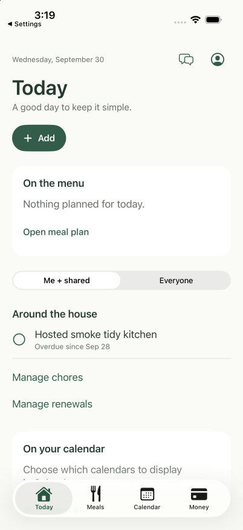

# SwiftUI permitted offline recovery — 30 September 2026

Source `ef9ec37c` on `codex/swiftui-chore-refresh-recovery` fixes a reproduced lost refresh: a chore completion queued after replay but during the snapshot read previously needed another refresh/restart. Today now retains one coalesced follow-up and owns accepted replay independently of cancellation of the presenting view's task. Account generations and SQLite leases still fence every response and queued operation.

The native scene/network observer resumes existing chore completions, grocery checks and retained Calendar-sharing removal when foreground and connected. A satisfied network path does not imply API availability. Exact uncertain commands remain journaled after failure. This trigger cannot enable Calendar sharing, publish events/busy ranges, send financial changes or replay saved grocery additions/edits/removals. Those online-only changes retain their explicit recovery. Calendar reconnection during a busy removal retains one account-bound follow-up; it cannot transfer to a later sign-in.

## Verification

- Before implementation, three deterministic native regressions produced eight failed assertions with no unexpected failures (`/private/tmp/nest-chore-refresh-before-20260930.log`). The paused server captures its stale snapshot before the queued completion, rather than accidentally returning the newer state.
- Final signed iOS simulator tests: **37 passed, zero failed/skipped**, 2.414 seconds (`/private/tmp/nest-offline-resume-privacy-final-20260930.log`). Four chore races, five resume cases and existing nine session, nine grocery, nine Calendar privacy and one consent model regressions run with real orchestration and SQLite plus controlled HTTP. Cancellation is honored by the chore test transport. Coverage includes two queued writes/40 coalesced refreshes, exact failed retries, presenter cancellation, account switches, inactive transitions, saved online-only writes remaining untouched, restored Calendar permission and a lost off reply during reconnection.
- Focused Foundation/SQLite replay checks: **15 passed, zero failed/skipped**, 0.611 seconds (`/private/tmp/nest-offline-resume-core-20260930.log`). No pure domain/database rule changed.
- Native compilation, strict recursive Swift formatting, 400/80/10 source limits, Oxfmt and actual push-disabled simulator signing pass. A missing `categoryId: nil` in an initial test fixture caused compilation failure and was fixed without relaxing assertions. Strict formatting later caught a long test comment; moving the comment changed no behavior.
- Ten final Mac/Linux Swift source hashes match the recorded files. The ordinary app was rebuilt/reinstalled with the test-only configuration. Actual Settings-to-Nest foreground transition preserves the **same process**, advances the exact test-origin scoped cache and leaves both permitted-check journals empty. Early/idle CPU samples are 0.2%/0%; this is not frame-performance certification or proof that a particular callback caused the cache write.
- Ordinary SDK session is Test Alex, API/test Supabase origins are guarded and push is disabled. Separate read-only balance and all 13 available financial history summaries retain SHA-256 `647a6641be579ffe113e28d406bb8bdc55288e8233fbfa14506a3afd921fc987`. The first helper read received401 because its diagnostic token expired; refreshing only the existing fictional credentials made the identity/fingerprint checks pass. This is a bounded API projection, not a raw-ledger audit.
- The actual normal-app screenshot below was inspected. No temporary rendering entry point, permission prompt or data injection was used in this final smoke.

## Remaining acceptance

Real airplane-mode/reconnection delivery, offline queued writes through native UI, background timing, VoiceOver, maximum-text pending Calendar banner, smallest iPhone and both phones remain unverified. The controlled transport checks do not establish hosted replay under an actual network outage. The real foreground smoke began with empty journals. No new ordinary hosted data write, personal event access, production migration, model/provider call, purchase, merge or beta submission occurred. Build10 does not contain this source. Both new-branch workflows passed at exact code/evidence head `43f4d0f0`: Nest36721387436 and SwiftUI36721387372. Prior navigation source independently passed its two recorded workflows.
